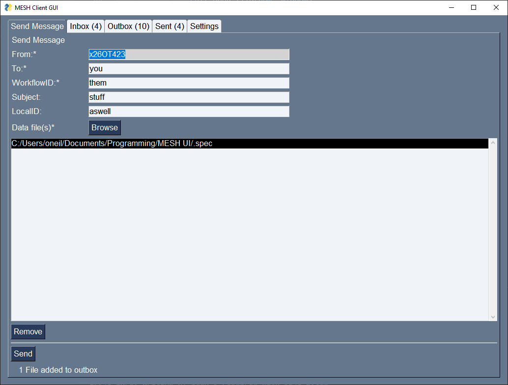
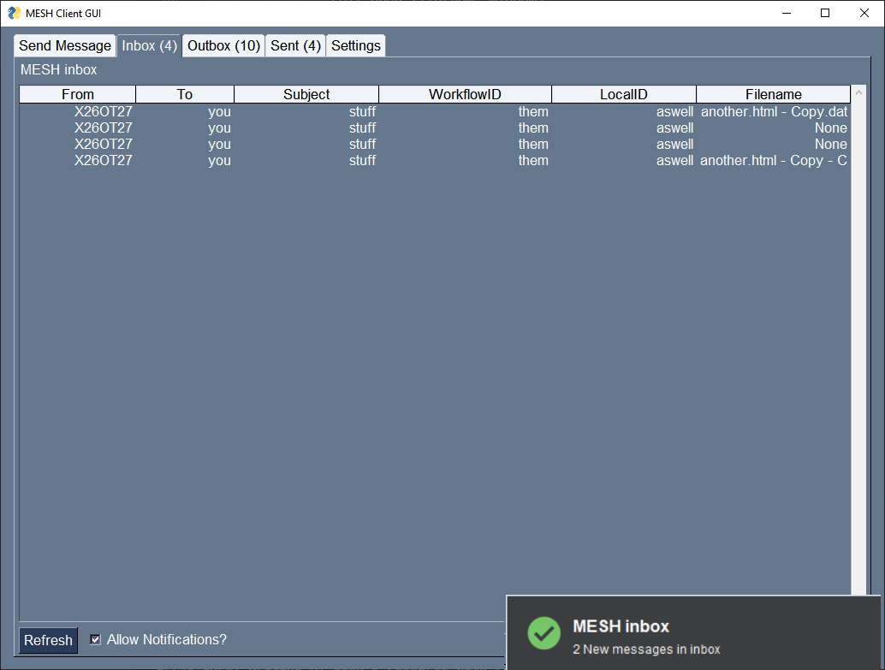

# MESH GUI

A GUI wrapper for the MESH (Messaging in Social and Healthcare) client

  

This GUI seeks to solve the following problems.

1. Creation of CTL files
2. Renaming of data files to .dat
3. Notifications of incoming files

## Todo:

Immediate:

- [x] ctl file generator
- [x] file dialog for selecting file to send
- [x] input for workflowID, subject, localid, recipient
- [x] inbox
- [x] outbox
- [x] send message
- [x] sent messages
- [x] add persistent configuration to autofill sender and MESH-DATA-HOME
- [x] add rightclick menu with a "save as" function
- [ ] add rightclicl "delete" function

Future:

- [ ] address book/ frequently used
- [x] notifications for incoming files
